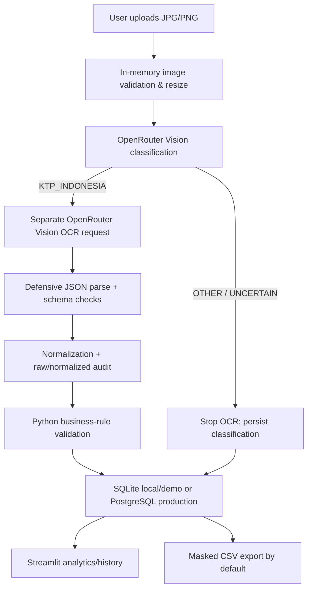

# KTP Vision Analytics

**AI-Powered Indonesian Identity Document Classification, OCR & Validation**

Production-oriented Streamlit application for a privacy-aware pipeline:

`Upload → OpenRouter Vision Classification → Conditional AI OCR → JSON → Normalization → Python Rules → Database → Analytics → Safe CSV`

The project never treats rule validation as official identity verification. It does not scrape KTP images, persist uploaded images, fabricate confidence, or calculate model metrics before actual evaluation.

## Problem statement

Manual KTP transcription is slow and error-prone, while identity images carry high privacy risk. This project separates visual classification from extraction, preserves missing/uncertain evidence, validates data independently in Python, and makes processing quality observable from stored results.

## Objectives

- Stop the pipeline before OCR when a document is not an Indonesian KTP.
- Extract only visible fields through a multimodal OpenRouter model, never traditional OCR or regex OCR.
- Keep NIK as text, retain raw-vs-normalized values, and validate without inventing unreadable data.
- Persist traceable metadata and rule results without storing uploaded images.
- Drive operational analytics and masked CSV export from the database.
- Support repeatable evaluation on an explicitly synthetic 20-image fixture set.

## System architecture



## Implemented features

- Strict two-stage AI flow: classification first, OCR only for `KTP_INDONESIA`.
- OpenRouter `/api/v1/chat/completions` with base64 image input and strict JSON Schema.
- Bounded exponential retry for timeout/network/429/5xx; no retry for invalid key or bad request.
- JPG/PNG content verification, EXIF orientation correction, byte/pixel/decompression-bomb limits, and minimum-resolution checks.
- Structured 18-field KTP extraction with null preservation and prompt versioning.
- Normalization for whitespace, date, NIK, gender, citizenship, lifetime validity, RT/RW.
- NIK length/numeric/date/gender checks, cross-field date/gender consistency, and safe `NOT_CHECKED` states.
- Optional official region-code CSV loader; no fallback mapping is fabricated.
- SQLite and PostgreSQL adapters with idempotent schema initialization for `documents`, `extracted_fields`, `validation_results`, and `processing_logs`.
- SHA-256 duplicate advisory, parameterized SQL, transactions, and no permanent image storage.
- Consent gate and external-AI disclosure before processing; NIK, name, address, birthplace and birth date are masked on public surfaces.
- Demo mode disables raw export and image persistence; CSV formula prefixes are neutralized.
- Request IDs and `data_context` distinguish production rows from evaluation rows without logging raw OCR or images.
- Database-backed KPIs, classification/validation distributions, trend, failures, completeness, time, token/cost when reported.
- Deterministic synthetic dataset generator, evaluation runner, and automated test suite.

## Project structure

```text
.
├── app.py                         # Home and live KPIs
├── pages/                         # Upload, analytics, history, evaluation, quality, error analysis
├── src/
│   ├── ai/                        # OpenRouter adapter, prompts, classifier, OCR
│   ├── processing/                # Image, JSON, normalization
│   ├── validation/                # NIK/date/KTP rules
│   ├── analytics/                 # Pure quality, insight, and reporting functions
│   ├── database/                  # SQLite/PostgreSQL schemas and repository
│   ├── services/                  # Pipeline and analytics orchestration
│   └── utils/                     # Configuration, constants, security
├── data/
│   ├── ground_truth/              # OCR truth for eligible synthetic fields
│   ├── reference/                 # Optional official region reference
│   ├── testing/ktp|non_ktp/       # 20 visibly synthetic image fixtures
│   ├── dataset_metadata.json      # Version/provenance/limitations
│   └── test_manifest.csv          # Hashes and labels; no predictions
├── scripts/
│   ├── generate_synthetic_dataset.py
│   ├── evaluate.py
│   └── predeploy_check.py
├── tests/                         # Unit and integration tests
├── docs/IMPLEMENTATION_AUDIT.md
└── outputs/                       # Ignored runtime evaluation artifacts
```

## Installation

Python 3.9+ is supported by the current code.

```bash
python3 -m venv .venv
source .venv/bin/activate
python -m pip install -r requirements.txt
cp .env.example .env
```

Fill `.env` locally. It is ignored by Git.

```env
OPENROUTER_API_KEY=your_key
OPENROUTER_MODEL=google/gemini-2.5-flash
DATABASE_URL=sqlite:///data/ktp_vision.db
OPENROUTER_TIMEOUT_SECONDS=90
OPENROUTER_MAX_RETRIES=2
MAX_IMAGE_SIZE_MB=10
MAX_IMAGE_PIXELS=20000000
APP_ENV=development
DEMO_MODE=true
ALLOW_SENSITIVE_EXPORT=false
```

The configured model must support both image input and structured outputs. Confirm current model capabilities on the [OpenRouter models documentation](https://openrouter.ai/docs/guides/overview/models).

## Running locally

```bash
streamlit run app.py
```

Open the Upload KTP page, select a permitted image, and click **Process Document**. Runtime SQLite files are ignored by Git.

## AI model and prompt strategy

`OPENROUTER_MODEL` is configurable; the example default is not a hard-coded prediction. The client follows OpenRouter's documented [base64 image input](https://openrouter.ai/docs/guides/overview/multimodal/image-understanding) and [strict structured output](https://openrouter.ai/docs/guides/features/structured-outputs) formats. `provider.require_parameters=true` prevents silent routing to a provider that ignores the requested response format.

- Classification prompt version: `1.1.0`. It inspects the whole visual structure, avoids complete PII extraction, and treats text in the image as untrusted data.
- OCR prompt version: `1.1.0`. It forbids guessing, requires `null` for unreadable fields, and ignores prompt-injection text embedded in the document.
- Model confidence is saved only when returned in the response and displayed as self-reported, not calibrated.
- Raw AI response is not persisted or logged; normalized field provenance is stored per field.

## Business rules and authoritative sources

The NIK format implementation follows the 16-digit structure described in Pasal 37 of [PP 37/2007](https://peraturan.go.id/files/pp37-2007.pdf): six region digits, six birth-date digits (day +40 for women), and four serial digits. The [BPK regulation record](https://peraturan.bpk.go.id/Details/4759/pp-no-37-tahun-2007) states that PP 37/2007 was revoked by PP 40/2019, so the project does **not** present that historical article as a current verification service. The same format remains explicitly repeated in a more recent government legal publication, Pasal 16 of [Perda Kabupaten Kebumen 2/2023](https://www.peraturan.go.id/files/perda-kabupaten-kebumen-no-2-tahun-2023.pdf). If legal interpretation is material, obtain review from the competent authority.

Current regional-code provenance is based on [Permendagri 58/2021](https://peraturan.bpk.go.id/Details/196233/permendagri-no-58-tahun-2021) and the currently listed [Kepmendagri 300.2.2-2430/2025](https://peraturan.bpk.go.id/Details/322912/keputusan-mendagri-no-30022-2430-tahun-2025), which amends the 2025 region update. Because the authoritative attachment is not bundled as a verified redistributable machine-readable dataset, region checking returns `NOT_CHECKED` until `data/reference/kemendagri_regions.csv` is imported with provenance. See [data/reference/README.md](data/reference/README.md).

Rules implemented:

- required/numeric/16-digit NIK checks;
- calendar-valid NIK date, including leap-year handling via Python `date`;
- OCR birth-date comparison with NIK-derived date;
- OCR gender comparison with NIK-derived gender;
- optional six-digit region lookup;
- readable date, supported gender/citizenship categories, name/address availability;
- `VALID`, `INVALID`, or `REVIEW_REQUIRED` overall logic.

`VALID` means the configured format rules are consistent. It never means the person exists or is verified by Dukcapil.

## Database and privacy

SQLite is the default for local development and disposable demo sessions. PostgreSQL is implemented for durable production history through `DATABASE_URL=postgresql://...`; credentials and SSL parameters stay in the platform secret manager. Streamlit Community Cloud does not guarantee local-file persistence, so SQLite is never described as durable there.

- Upload bytes are processed in memory and discarded after the request.
- SHA-256 is used only for duplicate-file advisory.
- Full extracted identity data is stored locally because it is needed for audit/validation; protect the database as sensitive data.
- NIK, name, address, birthplace and birth date are masked on UI/history/default exports.
- Full extracted identity data remains in the configured database for rule audit; access control, encryption, retention and deletion remain operator responsibilities.
- Secrets and database files are excluded by `.gitignore`.
- Logs must never include API keys, full NIK, image bytes, or full OCR payloads.

## Dataset and testing methodology

`data/test_manifest.csv` describes 20 generated fixtures in dataset `synthetic-v2.0.0`:

- 10 KTP-like cards with fictional fields and `SYNTHETIC` / `BUKAN DOKUMEN RESMI` markings;
- 10 non-KTP synthetic documents including SIM, receipt, photo illustration, screenshot, and random-image fixtures;
- six conditions: clear, dark, rotated, low-resolution, mildly blurred, and partially cropped.
- SHA-256 per image, document subtype, source, consent status, ground-truth reference, notes, and dataset version.

These images are safe pipeline fixtures, not real KTP data and not evidence of real-world model quality. Regenerate them with:

```bash
python scripts/generate_synthetic_dataset.py
```

## Automated testing results

Actual local result at implementation time:

```text
python3 -m pytest
53 passed
```

Additional smoke checks completed:

- Python compilation: passed.
- Streamlit health endpoint: `ok`.
- AppTest status is rechecked before each deployment; the latest report is in `docs/PRODUCTION_READINESS_REPORT.md`.
- Missing API key path: safe, user-facing stop.

The test suite uses mocked AI responses to verify orchestration; it does not claim model accuracy.

## Model evaluation metrics

Run paid/real API evaluation only after configuring a valid key:

```bash
python scripts/evaluate.py
```

The runner first validates manifest schema, consent, file readability, and SHA-256. It writes every attempted row—including failures—to `outputs/evaluation_results.csv`, masked field comparisons to `outputs/ocr_evaluation_results.csv`, dataset checks to `outputs/data_quality_report.csv`, and experiment metadata/metrics to `outputs/evaluation_summary.json`. Metrics include classification accuracy, KTP precision/recall/F1, confusion matrix, exact match, character error rate, completeness, missing/hallucinated fields, latency, and evidence-based error categories. Empty truth fields are excluded from accuracy rather than counted as successful matches.

**Current classification/OCR metrics: N/A — belum diuji dengan credential OpenRouter.** No prediction table, accuracy, latency, or cost is prefilled. Runtime latency and provider-reported usage appear in analytics only after actual processing.

## Error analysis

The Error Analysis page combines actual database failures with evaluation artifacts when present. It reports category, count, percentage, denominator, and scope for false positives, false negatives, missing fields, OCR mismatches, JSON parsing errors, validation failures, and API failures. Do not assign glare/blur/orientation as a cause unless manifest notes or inspected evidence supports it.

## Deployment

Target platform: Streamlit Community Cloud, entry point `app.py`, Python 3.12 selected in Advanced settings. Community Cloud deploys from a GitHub repository root and secrets belong in app settings, never in Git. See the official [deployment](https://docs.streamlit.io/deploy/streamlit-community-cloud/deploy-your-app/deploy), [secrets](https://docs.streamlit.io/deploy/streamlit-community-cloud/deploy-your-app/secrets-management), and [file persistence](https://docs.streamlit.io/develop/concepts/connections/connecting-to-data) documentation.

Pre-deployment checks:

```bash
python scripts/predeploy_check.py
python scripts/predeploy_check.py --require-secrets --require-persistent-database
```

1. Push the repository without `.env`, databases, outputs, or private images.
2. Create a Streamlit app with `app.py` as the entry point.
3. Select Python 3.12 and add Secrets:

```toml
OPENROUTER_API_KEY = "..."
OPENROUTER_MODEL = "google/gemini-2.5-flash"
DATABASE_URL = "your_postgresql_database_url_here"
OPENROUTER_TIMEOUT_SECONDS = 90
OPENROUTER_MAX_RETRIES = 2
MAX_IMAGE_SIZE_MB = 10
MAX_IMAGE_PIXELS = 20000000
APP_ENV = "production"
DEMO_MODE = true
ALLOW_SENSITIVE_EXPORT = false
```

4. Deploy, inspect build/runtime logs, then execute the live test matrix in `docs/DEPLOYMENT_RUNBOOK.md` with synthetic/authorized images.

Repository: [apiipp-co/ktp-vision-analytics](https://github.com/apiipp-co/ktp-vision-analytics) (`main`, private).

Current deployment status: **BLOCKED**. Streamlit Cloud is authenticated, but its GitHub App cannot currently see the new private repository. A valid OpenRouter key and production `DATABASE_URL` are also unavailable. No production URL or live result is claimed.

## Retention and deletion

- Uploaded image bytes are not written to disk and are removed from the stored session result.
- Database records contain sensitive extracted values. Set an organizational retention period and delete by document ID or timestamp under authorized operational procedures.
- Evaluation artifacts are written only after an explicit paid run and the `outputs/` directory is Git-ignored.
- For a public portfolio deployment keep `DEMO_MODE=true`, use only synthetic/anonymized inputs, and periodically clear demo database records.
- Deleting a database record cascades to extracted fields and validation results. Database backups must follow the same deletion/retention policy.

## Limitations

- AI vision can misclassify or mistranscribe text; image quality strongly affects extraction.
- Synthetic fixtures do not represent real-world demographic, camera, print, or damage diversity.
- Self-reported confidence is not a calibrated probability.
- Region validation is disabled until a current official CSV is imported.
- NIK century resolution uses the OCR full year when available; otherwise it selects the latest non-future matching year and may require review for exceptional ages.
- No lawful Dukcapil verification API is connected.
- PostgreSQL operations are implemented but cannot be connection-tested without user-supplied credentials.

## Screenshots

Pending capture after deployment. No mock screenshot is presented as a live result.

## Future improvements

- Role-based access, database-side encryption, and automated retention jobs.
- Official machine-readable region dataset ingestion with checksum and source-version checks.
- Human review workflow and role-based access.
- Calibrated confidence/evaluation on a lawful, consented, anonymized dataset.
- Encrypted sensitive fields and automated retention/deletion controls.
