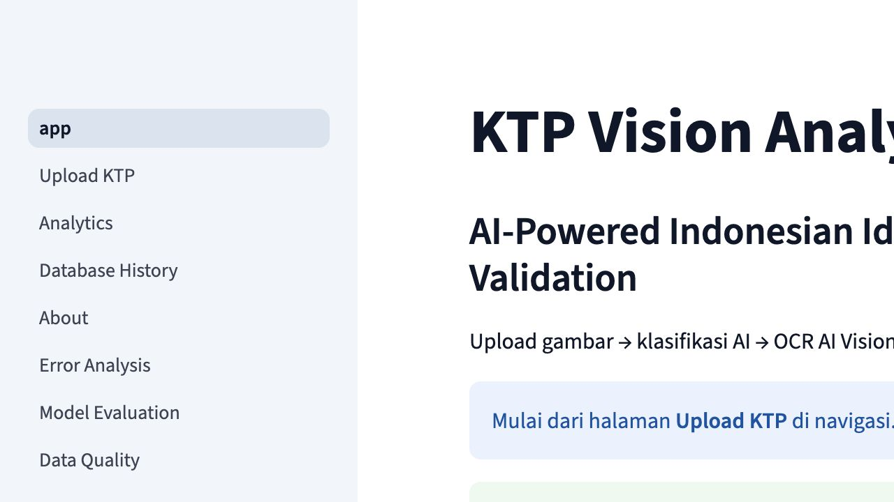
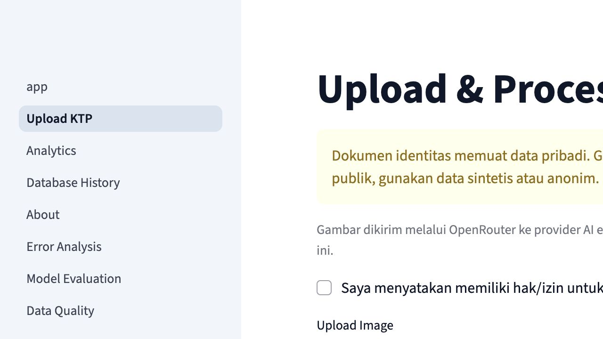
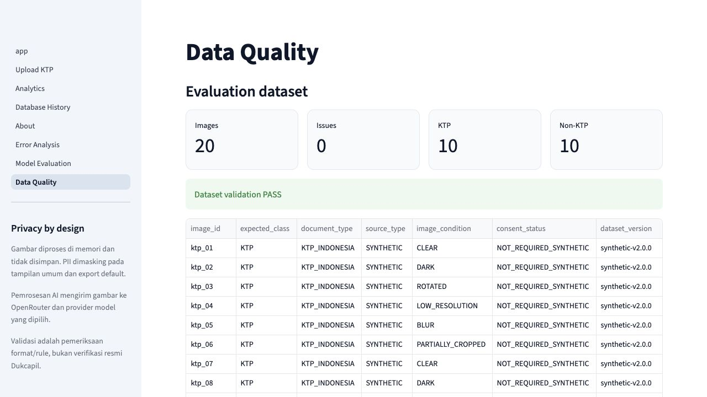

# KTP Vision Analytics

> AI-powered Indonesian identity-document classification, structured OCR, validation, and analytics through OpenRouter Vision.

KTP Vision Analytics is a production-oriented Streamlit application that classifies an uploaded image before conditionally extracting 18 KTP fields. It then normalizes the output, applies transparent Python rules, stores auditable results, and presents privacy-aware analytics.

The application does not claim official identity verification. It does not scrape KTP images, save uploaded image bytes, fabricate confidence, or publish model metrics before an actual evaluation.

## Table of contents

- [Problem and objectives](#problem-and-objectives)
- [Scope](#scope)
- [Screenshots](#screenshots)
- [Architecture and workflow](#architecture-and-workflow)
- [AI contracts and business rules](#ai-contracts-and-business-rules)
- [Database, analytics, and privacy](#database-analytics-and-privacy)
- [Dataset and evaluation](#dataset-and-evaluation)
- [Testing](#testing)
- [Technology stack and project structure](#technology-stack-and-project-structure)
- [Installation and usage](#installation-and-usage)
- [Deployment status](#deployment-status)
- [Limitations and roadmap](#limitations-and-roadmap)
- [Project evidence](#project-evidence)

## Problem and objectives

Manual KTP transcription is slow and error-prone, while identity images contain sensitive personal data. A single unconstrained OCR call can also waste inference cost on irrelevant images and turn unreadable text into invented values.

This project therefore aims to:

1. stop before OCR when an image is not an Indonesian KTP;
2. extract only visible fields and preserve missing evidence as null;
3. keep NIK as text and retain raw-versus-normalized values;
4. validate structure independently from the AI;
5. store traceable metadata without storing the uploaded image;
6. expose operational quality, latency, usage, and cost only when actually observed; and
7. support repeatable testing with an explicitly synthetic dataset.

## Scope

In scope:

- JPG/PNG upload validation, EXIF orientation, resizing, and decompression-bomb limits;
- OpenRouter multimodal classification and conditional structured OCR;
- defensive JSON parsing, 18-field normalization, and rule validation;
- SQLite for local/demo use and PostgreSQL for a durable production target;
- history, analytics, data-quality, model-evaluation, and error-analysis pages;
- masked CSV export, consent disclosure, duplicate rejection, and record deletion support;
- synthetic test fixtures, automated tests, and deployment-readiness checks.

Out of scope:

- Dukcapil lookup or proof that a person exists;
- fraud, liveness, face, signature, or biometric verification;
- storage of uploaded images;
- real-world model-quality claims based only on synthetic fixtures;
- public production use without authentication, encryption, retention controls, and a lawful basis.

## Screenshots

The images below are actual local application captures from 16 August 2026. They show empty or synthetic states; none is presented as a deployed production result.

### Home

### Upload consent and external-AI disclosure

### Validated synthetic dataset

## Architecture and workflow

~~~mermaid
flowchart LR
    U["Authorized JPG/PNG upload"] --> I["In-memory validation and resize"]
    I --> H["SHA-256 duplicate check"]
    H --> C["OpenRouter vision classification"]
    C -->|"OTHER or UNCERTAIN"| P["Persist classification; stop OCR"]
    C -->|"KTP_INDONESIA"| O["Separate structured OCR request"]
    O --> J["Defensive JSON parser"]
    J --> N["Normalization and field audit"]
    N --> V["Deterministic Python validation"]
    V --> D["SQLite local/demo or PostgreSQL target"]
    P --> D
    D --> A["Analytics, history, quality, errors"]
    D --> X["Masked CSV export"]
~~~

The key control is the classification gate: OCR is not called for OTHER or UNCERTAIN. Production-context duplicate hashes are rejected before classification so an identical upload does not incur another AI request. Evaluation-context duplicates remain allowed for repeat experiments.

End-to-end flow:

1. The user acknowledges lawful authority and external OpenRouter processing.
2. The image is verified by content, bounded by byte and pixel limits, orientation-corrected, and resized in memory.
3. Its SHA-256 hash is checked for a previous production record.
4. The classifier returns a strict object with is_ktp, document_type, optional self-reported confidence, and reason.
5. Only KTP_INDONESIA enters the OCR stage.
6. The OCR response is parsed against a closed 18-field contract; unreadable fields remain null.
7. Normalization and Python validation run independently of the model.
8. One transaction stores the document, field audit, rule results, and observed metadata.
9. Database-backed pages and safe exports expose the result.

## AI contracts and business rules

The configured model is supplied through OPENROUTER_MODEL. The application uses OpenRouter chat completions with base64 image input and strict JSON Schema. Provider parameter enforcement prevents silent routing to a provider that ignores the requested format.

Classification contract:

| Field | Type | Meaning |
|---|---|---|
| is_ktp | boolean | True only with KTP_INDONESIA |
| document_type | enum | KTP_INDONESIA, OTHER, or UNCERTAIN |
| confidence | number or null | Model-reported estimate, never treated as calibrated |
| reason | string | Bounded explanation for the decision |

OCR contract:

| Group | Fields |
|---|---|
| Identity | nik, nama |
| Birth | tempat_lahir, tanggal_lahir, jenis_kelamin |
| Address | alamat, rt, rw, kelurahan_desa, kecamatan |
| Civil | agama, status_perkawinan, pekerjaan, kewarganegaraan |
| Card/region | berlaku_hingga, provinsi, kabupaten_kota, golongan_darah |

Prompt versions are 1.1.0 for classification and OCR. Both prompts treat text inside the image as untrusted data, forbid following embedded instructions, and prohibit guessing. OCR additionally requires null for an unreadable field. Raw model responses are not persisted.

Implemented validation:

| Rule | Behavior | Possible result |
|---|---|---|
| NIK availability, numeric format, and length | Requires 16 numeric characters for full checks | VALID, INVALID, NOT_CHECKED |
| Encoded birth date | Parses day/month/year, including the female day offset | VALID, INVALID, NOT_CHECKED |
| Birth-date consistency | Compares OCR date with the NIK-derived date | VALID, INVALID, NOT_CHECKED |
| Gender consistency | Compares OCR gender with the NIK-derived gender | VALID, INVALID, NOT_CHECKED |
| Region code | Checks an imported official six-digit reference only | VALID, INVALID, NOT_CHECKED |
| Field/category checks | Date, gender, citizenship, name, and address | VALID, INVALID, NOT_CHECKED |
| Overall status | Critical invalid means INVALID; incomplete critical evidence means REVIEW_REQUIRED | VALID, INVALID, REVIEW_REQUIRED |

VALID means only that configured format rules are consistent. It never means official verification. Region checking deliberately returns NOT_CHECKED until a current, provenance-recorded official CSV is installed.

## Database, analytics, and privacy

~~~mermaid
erDiagram
    DOCUMENTS ||--o{ EXTRACTED_FIELDS : has
    DOCUMENTS ||--o{ VALIDATION_RESULTS : has
    DOCUMENTS o|--o{ PROCESSING_LOGS : referenced_by
    DOCUMENTS {
        integer id PK
        string request_id UK
        string document_hash
        string document_type
        string data_context
        string validation_status
        string processed_at
    }
    EXTRACTED_FIELDS {
        integer id PK
        integer document_id FK
        string field_name
        string raw_value
        string normalized_value
        boolean is_missing
    }
    VALIDATION_RESULTS {
        integer id PK
        integer document_id FK
        string rule_name
        string status
        boolean is_critical
    }
    PROCESSING_LOGS {
        integer id PK
        integer document_id FK
        string stage
        string level
        string created_at
    }
~~~

SQLite is appropriate for local development and disposable demos. PostgreSQL support is implemented as the durable production target. Streamlit Community Cloud local storage is not treated as persistent.

Operational pages provide:

- total processed, KTP rate, validation mix, failure rate, and processing trend;
- classification and validation distributions;
- field completeness, missingness, duplicate hashes, and timestamp quality;
- processing-time statistics and outlier hints;
- provider-reported token/cost totals only when present;
- false-positive, false-negative, OCR, JSON, validation, and API error categories;
- masked history and UTF-8-BOM CSV downloads suitable for spreadsheet tools.

Privacy and security controls:

- no uploaded-image persistence;
- no API key, full OCR payload, or image bytes in application logs;
- NIK, name, address, birthplace, and birth date masked on public surfaces;
- raw export disabled in demo mode and formula-injection prefixes neutralized;
- parameterized SQL and transactional writes;
- duplicate rejection before paid production inference;
- record deletion with database cascades;
- secrets, databases, outputs, and environment files excluded from Git;
- repository-wide pre-deployment secret and PII-pattern scanning.

The database still contains sensitive extracted values. A real operator must add authentication/RBAC, encryption, a lawful retention policy, deletion for backups, and incident-response controls.

## Dataset and evaluation

Dataset synthetic-v2.0.0 contains 20 project-generated fixtures:

| Class | Count | Notes |
|---|---:|---|
| Synthetic KTP-like | 10 | Fictional values and prominent SYNTHETIC / BUKAN DOKUMEN RESMI markings |
| Synthetic non-KTP | 10 | SIM-like card, receipt, illustration, screenshot, and random-image examples |

Condition coverage is CLEAR 4, DARK 4, ROTATED 4, LOW_RESOLUTION 4, BLUR 2, and PARTIALLY_CROPPED 2. The manifest stores expected class, subtype, condition, source, consent status, ground-truth reference, SHA-256, notes, and dataset version.

These images are safe pipeline fixtures, not representative evidence of real-world model quality.

Run the dataset generator:

    python scripts/generate_synthetic_dataset.py

Run a real OpenRouter evaluation only after adding a valid key:

    python scripts/evaluate.py

The runner validates the manifest, consent, readability, and hashes first. It then records every attempt, including failures, into ignored output artifacts. Metrics implemented include:

- classification accuracy = correct classifications / evaluated images;
- KTP precision = TP / (TP + FP);
- KTP recall = TP / (TP + FN);
- F1 = harmonic mean of precision and recall;
- per-field exact match over non-empty ground truth;
- character error rate, completeness, missing-field rate, and hallucination indicators;
- latency, provider-reported usage/cost, confusion matrix, and evidence-based error categories.

Current external results:

| Metric | Result | Reason |
|---|---:|---|
| Classification accuracy/precision/recall/F1 | N/A | No valid OpenRouter credential was available |
| OCR field accuracy/CER/completeness | N/A | No model prediction rows exist |
| External latency/tokens/cost | N/A | No paid evaluation was executed |
| Dataset integrity | PASS | 20/20 synthetic files, labels, hashes, consent fields, and ground truth validated |

Five evidence-based findings:

1. Finding: the dataset is internally reproducible. Evidence: all 20 manifest rows and SHA-256 values validate. Interpretation: the evaluation harness is ready, not the model score. Action: preserve version/hash metadata for every future run.
2. Finding: classes are balanced 10/10. Evidence: manifest counts. Interpretation: simple accuracy will not hide a majority-class baseline here. Action: still report precision, recall, F1, and the confusion matrix.
3. Finding: six image conditions are represented. Evidence: manifest condition counts. Interpretation: the fixtures exercise code paths but remain visually synthetic. Action: add lawful, consented, anonymized real-world diversity before production claims.
4. Finding: no AI prediction artifact exists. Evidence: no evaluation_results.csv or evaluation_summary.json from an API run. Interpretation: any non-N/A model metric would be fabricated. Action: execute the paid evaluation with a valid key and record model/prompt/dataset versions.
5. Finding: production deployment is blocked. Evidence: Streamlit Cloud cannot access the private repository and required secrets are absent. Interpretation: local readiness is not live readiness. Action: grant repository access, provision secrets/PostgreSQL, deploy, and execute the live matrix.

## Testing

Latest verified local result before final packaging:

    python3 -m pytest -q
    59 passed

Coverage includes:

- classification schema and conditional OCR orchestration;
- malformed JSON, retry behavior, missing secrets, and prompt-injection text;
- image type, byte, pixel, and decompression-bomb controls;
- normalization and NIK/date/gender validation;
- SQLite persistence, rollback, legacy-schema migration, cascaded deletion, and duplicate behavior;
- dataset manifests, hashes, ground truth, metrics, and CSV boolean handling;
- masking, safe export, PII/log constraints, and evaluation/production data separation.

The AI client is mocked in automated tests. Therefore 59 passing tests prove application behavior, not OpenRouter model accuracy. CI uses Python 3.12, installs requirements-dev.txt, runs tests, then runs the pre-deployment audit.

## Technology stack and project structure

| Layer | Technology |
|---|---|
| UI and analytics | Streamlit, pandas, Plotly |
| AI | OpenRouter multimodal chat completions, strict JSON Schema |
| Processing | Pillow, defensive JSON parsing, Python normalization |
| Validation | Deterministic Python rules |
| Data | SQLite and psycopg/PostgreSQL |
| Networking | httpx |
| Quality | pytest, Streamlit AppTest, pre-deployment scanner, GitHub Actions |

    .
    ├── app.py
    ├── pages/                  # Upload, analytics, history, errors, evaluation, quality
    ├── src/
    │   ├── ai/                # Client, prompts, classifier, OCR
    │   ├── analytics/         # Pure metrics, quality, insights
    │   ├── database/          # SQLite/PostgreSQL schemas and repository
    │   ├── processing/        # Image, JSON, normalization
    │   ├── services/          # Pipeline, dataset, evaluation, analytics
    │   ├── validation/        # NIK/date/KTP rules
    │   └── utils/             # Config, constants, masking/security
    ├── data/                  # Synthetic fixtures, manifest, truth, reference instructions
    ├── scripts/               # Dataset generation, evaluation, pre-deploy audit
    ├── tests/
    ├── docs/
    ├── requirements.txt      # Runtime dependencies
    └── requirements-dev.txt  # Runtime plus test dependencies

## Installation and usage

Prerequisites: Python 3.9 or newer, Git, and an OpenRouter key for real inference.

Clone the private repository if your GitHub account has access:

    git clone https://github.com/apiipp-co/ktp-vision-analytics.git
    cd ktp-vision-analytics

macOS/Linux:

    python3 -m venv .venv
    source .venv/bin/activate
    python -m pip install --upgrade pip
    python -m pip install -r requirements-dev.txt
    cp .env.example .env

Windows PowerShell:

    py -m venv .venv
    .venv\Scripts\Activate.ps1
    python -m pip install --upgrade pip
    python -m pip install -r requirements-dev.txt
    Copy-Item .env.example .env

Runtime-only deployment may install requirements.txt instead.

Environment variables:

| Variable | Default/example | Purpose |
|---|---|---|
| OPENROUTER_API_KEY | empty | Required for actual AI requests |
| OPENROUTER_MODEL | google/gemini-2.5-flash | Vision model with structured-output support |
| DATABASE_URL | sqlite:///data/ktp_vision.db | SQLite local or PostgreSQL target |
| OPENROUTER_TIMEOUT_SECONDS | 90 | Request timeout |
| OPENROUTER_MAX_RETRIES | 2 | Bounded retries for transient failures |
| MAX_IMAGE_SIZE_MB | 10 | Upload byte limit |
| MAX_IMAGE_PIXELS | 20000000 | Decoded pixel limit |
| APP_ENV | development | Environment label |
| DEMO_MODE | true | Disables risky demo behavior |
| ALLOW_SENSITIVE_EXPORT | false | Explicit raw-export gate |

Start locally:

    streamlit run app.py

Run quality checks:

    python -m pytest -q
    python scripts/predeploy_check.py

For production prerequisites:

    python scripts/predeploy_check.py --require-secrets --require-persistent-database

## Deployment status

Target: Streamlit Community Cloud, app.py, Python 3.12, PostgreSQL, secrets stored in platform settings.

Current status: BLOCKED, not deployed.

- The Streamlit account is authenticated, but its GitHub App cannot see the private repository.
- No valid OPENROUTER_API_KEY was available for final verification.
- No production PostgreSQL DATABASE_URL was available.
- Consequently there is no live URL, live screenshot, external model metric, or production persistence claim.

Resolution sequence:

1. Grant the Streamlit GitHub App access to apiipp-co/ktp-vision-analytics or choose an approved visibility strategy.
2. Provision an OpenRouter key and a TLS-enabled PostgreSQL database through secret management.
3. Run the strict pre-deployment check.
4. Deploy and inspect build/runtime logs.
5. Execute the complete live test matrix in docs/DEPLOYMENT_RUNBOOK.md using only synthetic/authorized inputs.
6. Add the verified URL and dated evidence only after every critical check passes.

## Limitations and roadmap

Known limitations:

- vision models can misclassify and mistranscribe;
- synthetic fixtures do not cover demographic, device, print, damage, glare, or fraud diversity;
- self-reported confidence is not calibrated;
- current official region data is not bundled, so region validation is NOT_CHECKED;
- no lawful Dukcapil verification API is connected;
- authentication/RBAC and field-level encryption are not implemented;
- PostgreSQL and actual OpenRouter behavior remain unverified without credentials;
- the private repository and missing secrets currently block live deployment.

Prioritized roadmap:

1. unblock repository access, provision secrets, and complete live verification;
2. execute and publish a versioned 20-image OpenRouter evaluation;
3. add authentication, role-based authorization, field encryption, retention jobs, and backup deletion;
4. ingest an authoritative region reference with source version and checksum;
5. add human-review queues and correction audit trails;
6. evaluate on a lawful, consented, anonymized dataset and calibrate thresholds;
7. add observability, budgets, rate limits, and production incident controls.

## Project evidence

- Final project report: [docs/FINAL_PROJECT_REPORT.md](docs/FINAL_PROJECT_REPORT.md)
- Final jury and red-team review: [docs/FINAL_JURY_REVIEW.md](docs/FINAL_JURY_REVIEW.md)
- Presentation outline: [docs/PRESENTATION_OUTLINE.md](docs/PRESENTATION_OUTLINE.md)
- Demo script: [docs/DEMO_SCRIPT.md](docs/DEMO_SCRIPT.md)
- Jury Q&A preparation: [docs/QNA_PREPARATION.md](docs/QNA_PREPARATION.md)
- Portfolio and interview copy: [docs/PORTFOLIO_DESCRIPTION.md](docs/PORTFOLIO_DESCRIPTION.md)
- Deployment runbook: [docs/DEPLOYMENT_RUNBOOK.md](docs/DEPLOYMENT_RUNBOOK.md)
- Security/privacy audit: [docs/SECURITY_PRIVACY_AUDIT.md](docs/SECURITY_PRIVACY_AUDIT.md)

One-sentence value proposition: KTP Vision Analytics turns authorized KTP images into auditable structured data while controlling AI cost, uncertainty, and privacy risk.
